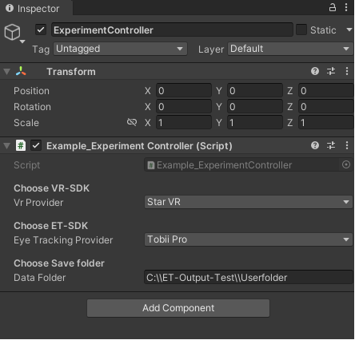

# ZERO: Eye Tracking Controller Interface for VR

ZERO is an open-source eye-tracking controller interface designed for virtual reality applications. This README provides guidance on how to integrate and use ZERO in your VR projects. The main purpose of ZERO is to support scientist who want to do eye-tracking in virtual reality. 


<!-- blank line -->

Click on the image to see the video about how to add the script:
<!-- blank line -->

[](https://youtu.be/k842mTuHbdM)

<!-- blank line -->


## Table of Contents
1. [Choose Devices](#1.-eye-tracking-and-vr-devices)
2. [How to access the controller](#2-how-to-access-the-controller)
3. [How to write gaze to file](#3-how-to-write-gaze-to-file)
4. [Get Live Gaze signal](#4-get-live-gaze-signal)
5. [Call device specific calibration](#5-call-device-specific-calibration)
6. [Device specific functions](#6-device-specific-functions)
7. [How to add a new Eye-tracker to ZERO](#6-how-to-add-a-new-eye-tracker-to-zero)
8. [How it works](#7-how-it-works)
9. [Add new Events and Listeners](#9-add-new-events-and-listeners)
10.[Reference](#10-reference)


## Unity inspector settings
To use the script you can attach the ZERO script to any game object on top level.
The inspector view has the following options:
- Choose your VR glasses 
- Choose eye-tracking device
- Specify if you want to save gaze files
- Specify the path where ZERO saves gaze files.
- Start initial calibration on load





## 2. How to access the controller

If you want to have more control of what is happening when, you can use these functions to personalize ZERO to your needs.
```
ZERO etController;							# create new object of ZERO by taking the ET provider from the public inspector variable.
etController = new ZERO(Providers eyeTrackingProvider);		

etController.StartET();							# start harvesting gaze samples from the device
etController.StopET();							# stop harvesting et samples
etController.CloseET();							# close all et processes and threads
etControler.etpc.eyeTrackingProviderInterface;			# returns the singleton of the eye tracking device
etControler.etpc.isCalibrated();				# Returns wether the eye tracker is calibrated or not


```

## 3. How to write gaze to file

When you checked "Write gaze to file" checkbox in the inspector, ZERO takes care about saving gaze files for each user in the personal user folders.
This is done with an GazeWriter Object.

    * this.gazeWriter = new GazeWriter(userFolder, this, this.etController.getSetEyeTracker);      // GazeWriter constructor

   * this.gazeWriter.startGazeWriting();                                                          // Start writing gaze samples to file
   * this.gazeWriter.stopGazeWriting();                                                           // stop gaze writer and close file.

## 4. Get Live Gaze signal

     * this.etController.getSetEyeTracker.ET_NewSampleAvailable_Event += GetCurrentGazeSignal;      // Register a method that is called when the eye tracker has a new sample


## 5. Call device specific calibration

etController.etpc.Calibrate()		# to call device specific calibration procedure any time

## 6. Device specific functions


## 7. How to add a new Eye-tracker to ZERO

## 8. How it works


## 9. Add new Events and Listeners

How to Add Event listeners:

Let's assume we want to raise an event (let's call it "TrialEndedEvent") in our ExperimentController 
Gameobject when the key "C" on the keyboard is clicked and listen to it in our GazeWriter.

```
void Update()
{
		if (Input.GetKeyUp(KeyCode.C))
		{
			TrialEndedEvent();
		}
}
```

We have to define a delegate (which defines a callback or event listener ) somewhere public. 
To have a tidy code, we add it to our "Delegates.cs"
Let's call our delegate TrialEndedEvent_delegate, but you can name whatever you want.

```
public delegate void TrialEndedEvent_delegate();
```

We can only call events that are connected to a delegate. To create an event, 
we add it as a class member to a class in which the event will be raised.
Our event has to have the type of the delegate we just created.

```
public event TrialEndedEvent_delegate TrialEndedEvent;
```

Now we created an event we can raise when something happens.
We also created a delegate that allows us to add listeners to that event.

To add a listener to that event: Let's say we want to listen to that new event in our GazeWriter.
This time we have to add our listener inside the constructor of the class we want to handle the event.

```
public class GazeWriter
{
	public GazeWriter(...)
	{
		// Register a method "TrialEndedEvent_handlerMethod" to listen to the event "TrialEndedEvent"
		// raised by the Class "ExperimentController".
		ExperimentController.TrialEndedEvent += TrialEndedEvent_handlerMethod;
	}
}
```
Create the handler method

```
public void MyEvent_handlerMethod()
{
	// Do what you want to do when the letter c is pressed.
	e.g. write down a message with a timestamp into our events.csv file.
	
}
```


Note: It is also possible to add parameters to delegates.

1. Raise event with parameter: MyEvent(cCode);
2. Tell delegate that we want to access a parameter: public delegate void MyEvent_delegate(string cCode);
3. Add the parameter to your handler method: public void MyEvent_handlerMethod(string cCode)

And to listen to events raised by objects. Then you have to change your registration to that object:

```
ExperimentController.MyEvent += MyEvent_handlerMethod;
to
myObject.MyEvent += MyEvent_handlerMethod;
```

## 10. Reference

If you use ZERO in your research, please cite the following paper: 

@inproceedings{   
	&nbsp; hosp2023zero,   
	&nbsp; title={ZERO: A Generic Open-Source Extended Reality Eye-Tracking Controller Interface for Scientists},   
	&nbsp; author={Hosp, Benedikt W and Wahl, Siegfried},   
	&nbsp; booktitle={Proceedings of the 2023 Symposium on Eye Tracking Research and Applications},   
	&nbsp; pages={1--4},   
	&nbsp; year={2023}   
  }